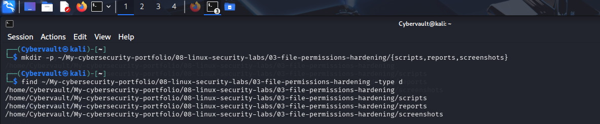
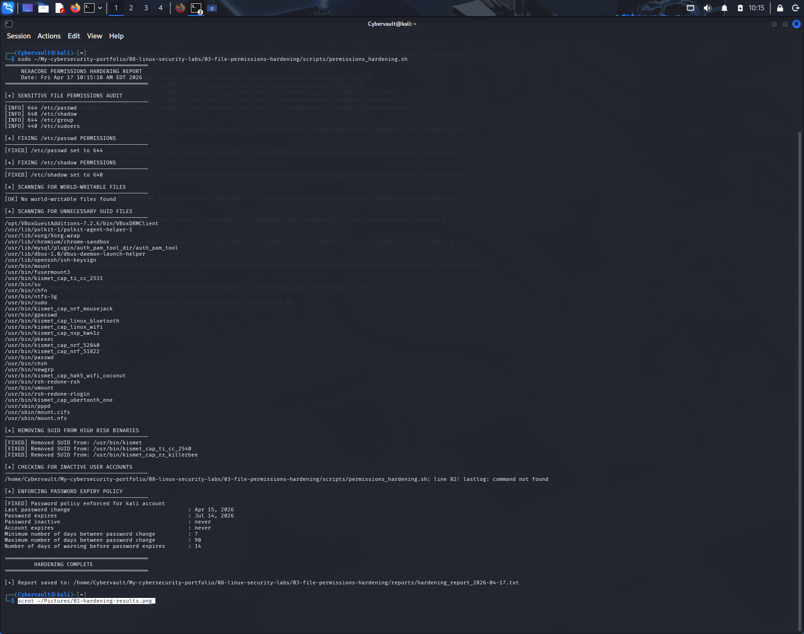

# Linux File Permissions & Access Control Hardening

## Scenario

The security audit conducted on NexaCore Technologies' internal Linux server revealed suspicious SUID binaries, multiple accounts with elevated sudo privileges, and misconfigured file permissions. The subsequent network monitoring phase detected a brute force attack against the SSH service, confirming active exploitation attempts.

With the threat contained, management tasked the security team with hardening the server before returning it to production. As the Security Analyst assigned to the case, you were responsible for building an automated hardening script that audits and remediates dangerous file permissions, removes unnecessary SUID flags, enforces password policies, and produces a structured hardening report for the security team.

## Objective

Develop a bash script that automatically audits and remediates Linux file permission misconfigurations across 8 hardening categories, reducing the server's attack surface before returning it to production.

## Script Overview

The hardening script performs sequential auditing and remediation across eight security categories using native Linux tools.

| Command | Purpose |
|---|---|
| `stat -c "%a %n"` | Audit current permissions on sensitive files |
| `chmod 644` | Fix /etc/passwd permissions |
| `chmod 640` | Fix /etc/shadow permissions |
| `find` with `-perm -0002` | Detect world-writable files |
| `chmod o-w` | Remove world-write permission from flagged files |
| `find` with `-perm -4000` | Identify all SUID binaries on the system |
| `chmod u-s` | Remove SUID flag from high risk binaries |
| `chage` | Enforce password expiry policy on user accounts |

## Step 1 — Setting Up the Project

The project folder structure was created to organise scripts, reports, and screenshots.

```bash
mkdir -p ~/My-cybersecurity-portfolio/08-linux-security-labs/03-file-permissions-hardening/{scripts,reports,screenshots}
```



## Step 2 — Making the Script Executable

After writing the hardening script, execute permissions were granted before running it.

```bash
chmod +x scripts/permissions_hardening.sh
ls -l scripts/permissions_hardening.sh
```

## Step 3 — Running the Hardening Script

The script was executed against the NexaCore server to audit and remediate all permission misconfigurations across 8 categories.

```bash
sudo ./scripts/permissions_hardening.sh
```



## Hardening Findings — NexaCore Server

| Finding | Risk Level | Action Taken | Result |
|---|---|---|---|
| /etc/passwd permissions | Low | Verified and set to 644 | Fixed ✅ |
| /etc/shadow permissions | High | Verified and set to 640 | Fixed ✅ |
| /etc/sudoers permissions | High | Verified at 440 | Confirmed ✅ |
| World-writable files | High | Scanned entire filesystem | None found ✅ |
| 30+ SUID binaries identified | Medium | Audited full SUID binary list | Documented ⚠️ |
| kismet SUID flag | High | Removed SUID from kismet and related binaries | Fixed ✅ |
| Password expiry policy | Medium | Enforced 90 day maximum, 7 day minimum, 14 day warning | Fixed ✅ |

## Analyst Interpretation

**File Permission Hardening**
Sensitive system files such as /etc/shadow store hashed user passwords. If this file is readable by unauthorised users, offline password cracking becomes trivial. Setting /etc/shadow to 640 ensures only root and the shadow group can read it, eliminating this risk.

**SUID Binary Risk**
Over 30 SUID binaries were identified on the server. While many are legitimate system tools, binaries such as kismet — a wireless network scanner — have no business justification for running with root privileges on a production server. The SUID flag was removed from all high risk binaries identified during the Project 1 audit, closing a direct privilege escalation path.

**Password Policy Enforcement**
Prior to hardening, no password expiry policy was enforced on the kali account. With the password now set to expire every 90 days, the window of opportunity for credential-based attacks is significantly reduced. Combined with the brute force detection implemented in Project 2, this forms a layered defence against unauthorised access.

**Connection to Previous Findings**
This project directly remediates the risks identified during the Project 1 security audit — specifically the SUID binaries and permission misconfigurations flagged at the time. Together, Projects 1, 2, and 3 form a complete detect, monitor, and remediate security workflow.

## Skills Demonstrated

- Linux File Permission Auditing and Remediation
- SUID Binary Analysis and Hardening
- Privilege Escalation Path Elimination
- Password Policy Enforcement
- System Hardening and Attack Surface Reduction
- Bash Scripting and Automation
- Security Reporting and Documentation
- Incident Response and Remediation

## How to Run

```bash
git clone https://github.com/Cybervault-1/My-cybersecurity-portfolio.git
cd My-cybersecurity-portfolio/08-linux-security-labs/03-file-permissions-hardening
chmod +x scripts/permissions_hardening.sh
sudo ./scripts/permissions_hardening.sh
```

The script prints all findings and fixes to the terminal in real time and saves a complete timestamped report to the `reports/` directory upon completion.

## Future Improvements

- Extend SUID remediation to cover all non-essential binaries automatically
- Integrate with a centralised SIEM platform to ship hardening reports in real time
- Add SSH hardening — disable root login, enforce key-based authentication, restrict allowed users
- Implement automated firewall rule hardening using iptables
- Schedule recurring hardening checks using cron to detect permission drift over time

## Author

**Adedeji Adetayo**
Cybersecurity Analyst
[GitHub](https://github.com/Cybervault-1)
