## Scenario

With the Linux server audited, network threats detected, and permissions hardened, the final phase of the NexaCore Technologies security engagement began.

> *"We run Splunk in our environment for centralised log monitoring. Before this server goes back into production, I need it feeding logs directly into Splunk. I want our SOC team to be able to detect brute force attempts, privilege escalation, and suspicious activity on this server from the Splunk dashboard — without ever having to log into the machine manually."*

As the Security Analyst assigned to the engagement, the Splunk Universal Forwarder was configured on the Linux server to ship live logs to NexaCore's Splunk instance. SPL detection queries were written targeting the specific threats uncovered during the audit and network monitoring phases, and a SOC dashboard was built giving the team full visibility into the server in real time.

## Objective

Configure the Splunk Universal Forwarder on Kali Linux to forward live system logs to a Splunk Enterprise instance, write SPL detection queries for threats identified across the previous three projects, and build a centralised SOC monitoring dashboard.

## Architecture Overview

| Component | Role | Location |
|---|---|---|
| Kali Linux | Log source — generates auth, syslog, kern logs | 192.168.56.101 |
| Splunk Universal Forwarder | Collects and ships logs to Splunk | Kali Linux |
| Splunk Enterprise | Receives, indexes and visualises logs | Windows 192.168.56.1 |

## Step 1 — Connectivity Test

Before configuring the forwarder, connectivity between the Kali Linux machine and the Windows Splunk instance was verified.

```bash
ping 192.168.56.1 -c 4
```

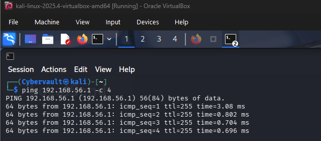

## Step 2 — Configure Splunk to Receive Data

Splunk Enterprise was configured to listen for incoming forwarded data on port 9997 — the industry standard port for Splunk Universal Forwarder communication.

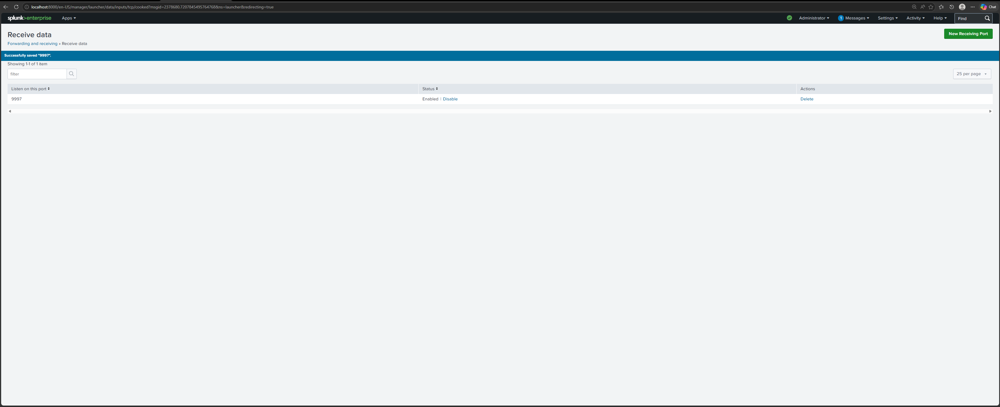

## Step 3 — Download Splunk Universal Forwarder

The Splunk Universal Forwarder was downloaded on Kali Linux.

```bash
wget -O splunkforwarder.deb "https://download.splunk.com/products/universalforwarder/releases/9.2.1/linux/splunkforwarder-9.2.1-78803f08aabb-linux-2.6-amd64.deb"
```

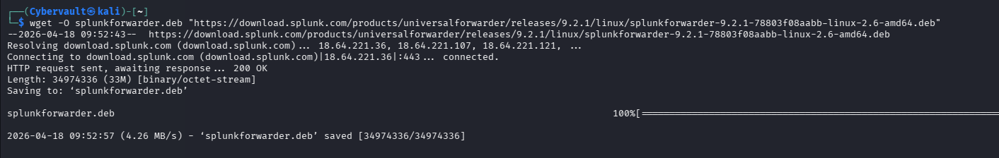

## Step 4 — Install Splunk Universal Forwarder

```bash
sudo dpkg -i splunkforwarder.deb
```

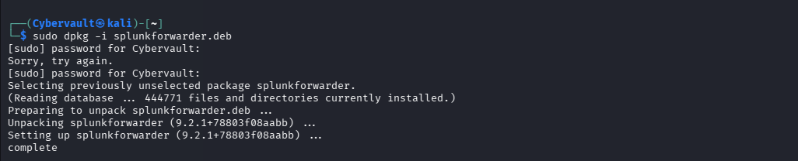

## Step 5 — Start the Forwarder

```bash
sudo /opt/splunkforwarder/bin/splunk start --accept-license
```

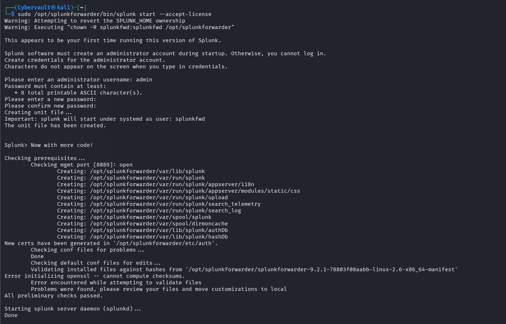

## Step 6 — Configure Forwarding to Splunk

The forwarder was pointed at the Splunk Enterprise instance on the Windows machine using port 9997.

```bash
sudo /opt/splunkforwarder/bin/splunk add forward-server 192.168.56.1:9997 -auth admin:yourpassword
```

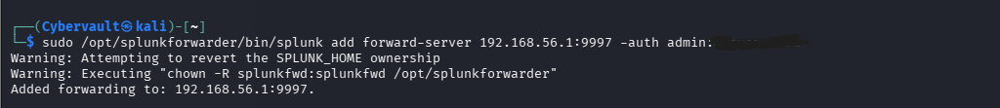

## Step 7 — Add Log Sources

Three critical log sources were configured for forwarding — authentication logs, system logs, and kernel logs.

```bash
sudo /opt/splunkforwarder/bin/splunk add monitor /var/log/auth.log -index main -sourcetype linux_auth -auth admin:yourpassword
sudo /opt/splunkforwarder/bin/splunk add monitor /var/log/syslog -index main -sourcetype syslog -auth admin:yourpassword
sudo /opt/splunkforwarder/bin/splunk add monitor /var/log/kern.log -index main -sourcetype linux_kern -auth admin:yourpassword
```

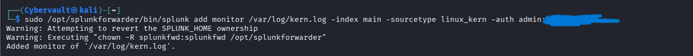

## Step 8 — Verify Logs in Splunk

After restarting the forwarder, live logs from the Kali Linux machine were confirmed to be arriving in Splunk Enterprise.
index=main sourcetype=linux_auth

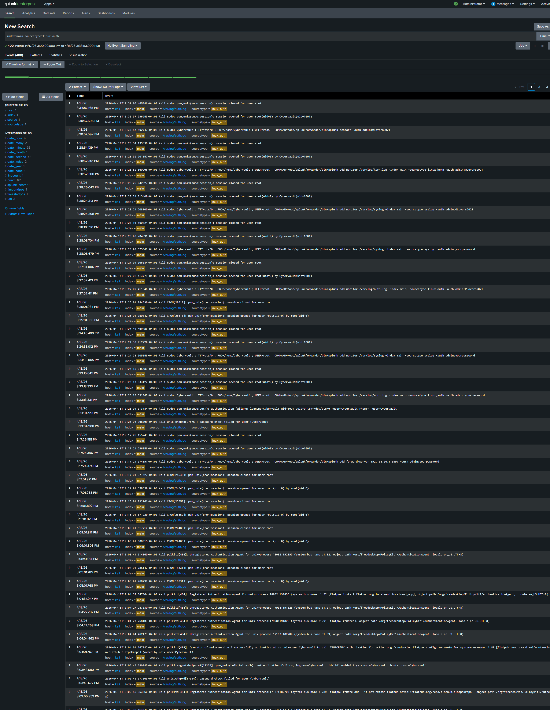

## Step 9 — SPL Detection Queries

Four SPL queries were written to detect the specific threats identified across Projects 1, 2 and 3.

### Failed SSH Login Attempts

Detects brute force activity — directly tied to the hydra attack simulation in Project 2.
index=main sourcetype=linux_auth "Failed password" | stats count by host | sort -count

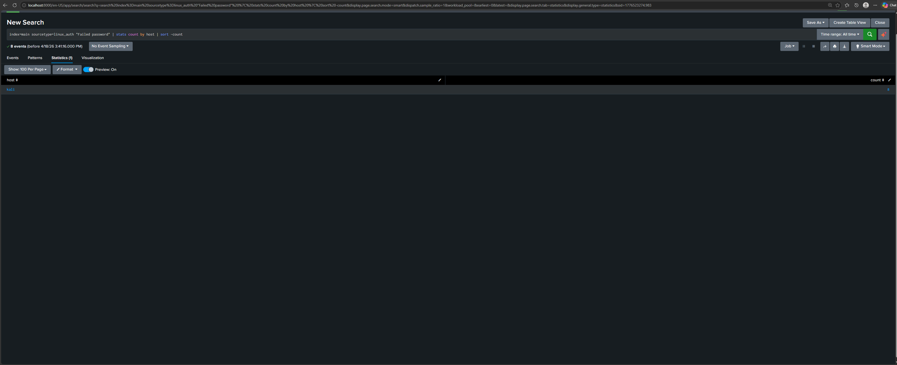

### Successful SSH Logins

Confirms whether any brute force attempts succeeded.
index=main sourcetype=linux_auth "Accepted password" | table _time, host, user

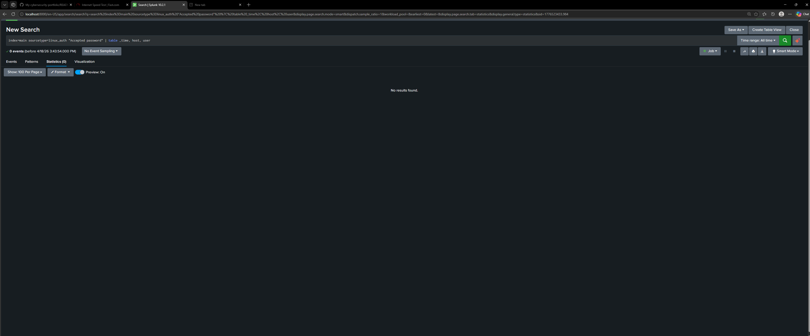

### Sudo Usage

Tracks all privilege escalation events — directly tied to the sudo findings in Project 1 and Project 3.
index=main sourcetype=linux_auth "sudo" | table _time, host, user, _raw

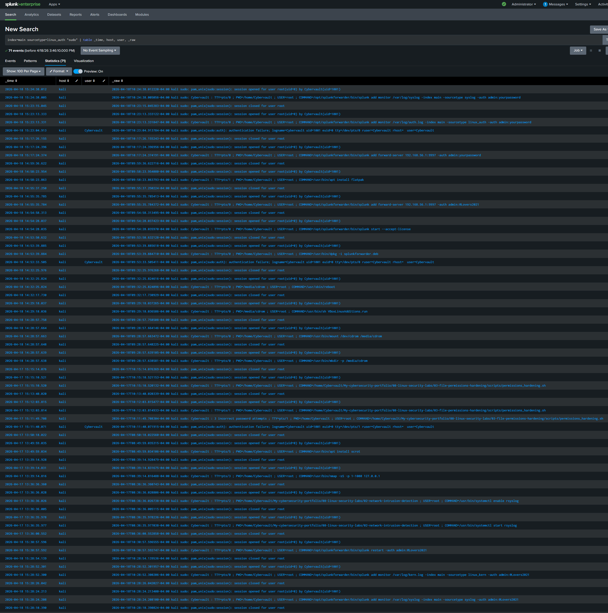

### System Errors and Failures

Monitors system-level errors and failures across the server.
index=main sourcetype=syslog "error" OR "failed" | stats count by host | sort -count

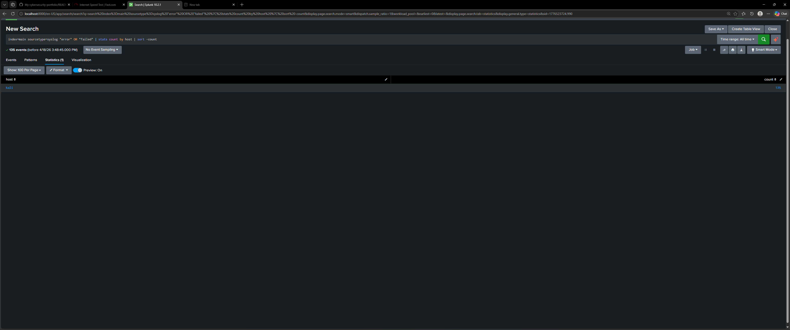

## Step 10 — SOC Monitoring Dashboard

A centralised SOC dashboard was built in Splunk consolidating all four detection queries into a single view for the NexaCore security team.

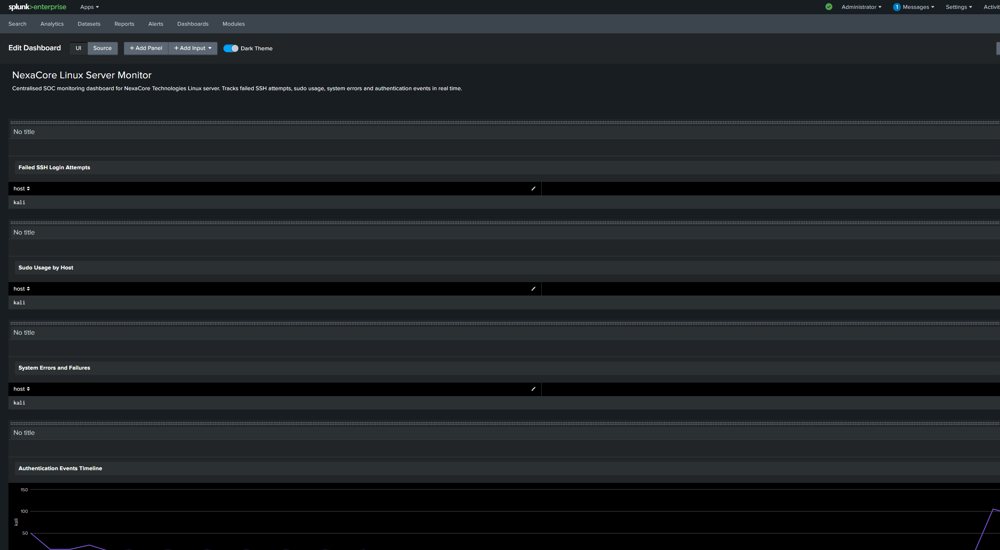

## Detection Findings

| Query | Finding | Risk Level | Significance |
|---|---|---|---|
| Failed SSH Login Attempts | 8 failed attempts from kali host | High | Confirms brute force activity detected and logged |
| Successful SSH Logins | 0 successful logins | Low | Brute force attack failed — server not compromised |
| Sudo Usage | 71 sudo events recorded | Medium | Full audit trail of privileged commands captured |
| System Errors | 135 system errors detected | Medium | Elevated error count warrants investigation |

## Analyst Interpretation

**Brute Force Detection**
The SPL query confirmed 8 failed SSH login attempts originating from the kali host — consistent with the hydra brute force simulation performed in Project 2. The absence of any successful logins confirms the attack was unsuccessful and the server was not compromised.

**Privilege Escalation Monitoring**
71 sudo events were captured across the monitoring period, providing a complete forensic audit trail of every privileged command executed on the server. This directly addresses the risk identified in Project 1 where multiple accounts held sudo privileges following the contractor engagement.

**End-to-End Security Workflow**
This project completes the full NexaCore security engagement — from initial audit and threat detection through to hardening and continuous monitoring. All four projects together demonstrate a complete SOC workflow: identify, detect, remediate, and monitor.

**Note on File Transfer Method**
Screenshots were transferred from the Windows Splunk instance to Kali Linux using SCP — the same protocol commonly used by threat actors for data exfiltration. In this controlled lab environment, SCP was used for legitimate file transfer between authorised systems. This highlights the dual-use nature of network tools and the importance of monitoring file transfer activity in production environments.

## Skills Demonstrated

- Splunk Universal Forwarder Installation and Configuration
- Linux to SIEM Log Pipeline Setup
- SPL Query Writing and Threat Detection
- SOC Dashboard Development
- Cross-Platform Security Integration
- Brute Force Detection and Analysis
- Privilege Escalation Monitoring
- Security Reporting and Documentation

## How to Reproduce

```bash
# Install Splunk Universal Forwarder
sudo dpkg -i splunkforwarder.deb
sudo /opt/splunkforwarder/bin/splunk start --accept-license

# Configure forwarding
sudo /opt/splunkforwarder/bin/splunk add forward-server SPLUNK_IP:9997 -auth admin:password

# Add log sources
sudo /opt/splunkforwarder/bin/splunk add monitor /var/log/auth.log -index main -sourcetype linux_auth -auth admin:password
sudo /opt/splunkforwarder/bin/splunk add monitor /var/log/syslog -index main -sourcetype syslog -auth admin:password
sudo /opt/splunkforwarder/bin/splunk add monitor /var/log/kern.log -index main -sourcetype linux_kern -auth admin:password

# Restart forwarder
sudo /opt/splunkforwarder/bin/splunk restart -auth admin:password
```

## Future Improvements

- Configure real-time alerting in Splunk for brute force threshold breaches
- Add Splunk correlation searches to detect lateral movement patterns
- Integrate threat intelligence feeds for automatic IP reputation lookups
- Extend log forwarding to include audit logs for SUID binary execution tracking
- Implement Splunk dashboards for all servers across the NexaCore environment

## Author

**Adedeji Adetayo**
Cybersecurity Analyst
[GitHub](https://github.com/Cybervault-1)
